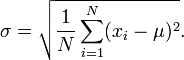
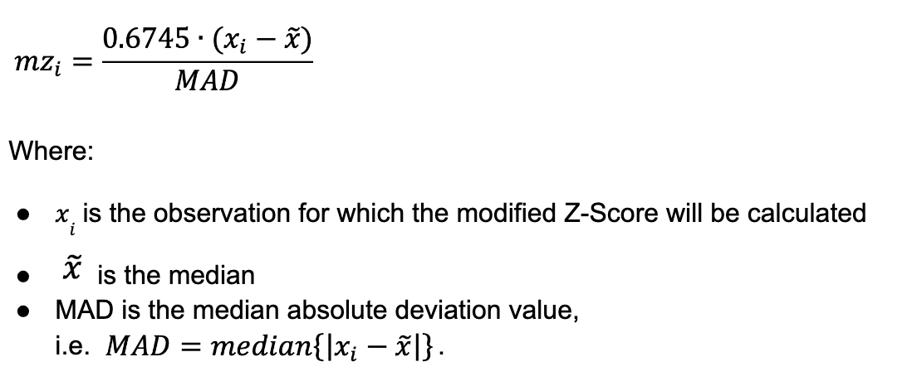

+++
date = '2025-12-22T12:44:47+10:00'
draft = false
title = 'Anomaly Detection'
tags = ['Anomaly Detection', 'Outlier Detection', 'Machine learning']
summary = "Comprehensive Guide to mastering Anomaly Detection in Machine Learning"
+++

## Phase 1: Foundations & Robust Statistics
**Statistical Fundamentals**
### Descriptive statistics:
### Mean
- **What:** Average of all values (sum ÷ count)
- **Use when:** Normal distributions, no outliers, need interpretability
- **Don't use when:** Outliers present, skewed data (income, response times)

### Median
- **What:** Middle value when sorted (50th percentile)
- **Use when:** Outliers exist, skewed distributions, need robust center
- **Don't use when:** Perfect normal data, need mathematical operations, very small samples

### Variance
- **What:** Average squared distance from mean
- **Use when:** Measuring spread, normal data, statistical modeling
- **Don't use when:** Outliers present, need interpretable units, heavy-tailed distributions

### Standard Deviation

- **What**: Square root of variance (spread in original units)
- **Use when**: Describing spread, normal data, Z-scores, confidence intervals 
- **Don't use when**: Outliers present, skewed data (use IQR/MAD instead)

### Percentiles
- **What:** Value below which X% of data falls (e.g., 25th, 95th)
- **Use when:** Setting thresholds, skewed data, SLA monitoring (p99 latency)
- **Don't use when:** Small datasets (<30), need smooth math properties
- Probability distributions: normal, exponential, Poisson
- Understanding what "normal" means in your data

# Statistical Measures: Quick Reference

## Descriptive Statistics

### Mean
- **What:** Average of all values (sum ÷ count)
- **Use when:** Normal distributions, no outliers, need interpretability
- **Don't use when:** Outliers present, skewed data (income, response times)

### Median
- **What:** Middle value when sorted (50th percentile)
- **Use when:** Outliers exist, skewed distributions, need robust center
- **Don't use when:** Perfect normal data, need mathematical operations, very small samples

### Variance
- **What:** Average squared distance from mean
- **Use when:** Measuring spread, normal data, statistical modeling
- **Don't use when:** Outliers present, need interpretable units, heavy-tailed distributions

### Percentiles
- **What:** Value below which X% of data falls (e.g., 25th, 95th)
- **Use when:** Setting thresholds, skewed data, SLA monitoring (p99 latency)
- **Don't use when:** Small datasets (<30), need smooth math properties

---

## Robust Statistical Methods
### Overview
The below is used for univariate outlier detection and spread measurement when data is non-normal or contains outliers.

### Standard Deviation
- **What:** Square root of variance (spread in original units)
- **Use when:** Describing spread, normal data, Z-scores, confidence intervals
- **Don't use when:** Outliers present, skewed data (use IQR/MAD instead)
- **Details**
  - Uses mean as the center
  - Measures average distance from mean
  - Sensitive to outliers - one extreme value can inflate it dramatically
  - Assumes roughly normal distribution
- **Formula**: 




### Median Absolute Deviation (MAD) ⭐
- **What:** Median of absolute deviations from median (robust spread measure)
- **Use when:** Outliers present, skewed data, production systems, finance/manufacturing
- **Don't use when:** Perfect normal data where standard deviation suffices
- **Details**
  - Uses median as the center
  - Measures median distance from median
  - Robust to outliers - extreme values don't distort it
  - Works with any distribution shape

- **Formula**: 


### Interquartile Range (IQR)
- **What:** Distance between 75th and 25th percentiles (middle 50% spread)
- **Use when:** Outlier detection, box plots, skewed distributions, quick EDA
- **Don't use when:** Small samples (<20), need precise statistical modeling

### Tukey's Fences
- **What:** Outlier boundaries at Q1 - 1.5×IQR and Q3 + 1.5×IQR
- **Use when:** Quick outlier flagging, exploratory analysis, box plot rules
- **Don't use when:** Need domain-specific thresholds, multivariate data
- Box Plot is one of the visualization that often uses Tukey's fences

### Z-Score (Standard Score)
- **What**: Number of standard deviations a value is from the mean: (x - mean) / SD
- **Use when**: Normal data, standardizing features, detecting outliers in clean data (|z| > 3)
- **Don't use when**: Outliers present (use Modified Z-score), skewed data, small samples
- **Formula**


### Modified Z-Score
- **What:** Z-score using median and MAD instead of mean and SD
- **Use when:** Outliers contaminate mean/SD, need robust standardization
- **Don't use when:** Clean normal data, classical Z-score works fine
- **Forumla**



---

## Phase 1.5: Visual & Exploratory Detection ⭐⭐
### Univariate Visualization**
### Histograms ⭐ - spot distribution shape, outliers at tails

A histogram represents the frequency distribution of continuous data by dividing it into bins (intervals) and counting how many values fall into each bin. Unlike bar charts that show categorical data, histograms display numerical distributions.

## Libraries Overview

We'll explore histogram creation using:
- **Matplotlib** - The foundational plotting library
- **Seaborn** - Statistical visualization built on Matplotlib
- **Plotly** - Interactive web-based visualizations
- **Pandas** - Quick plotting from DataFrames
- **NumPy** - Computing histogram data

## 1. Matplotlib

Matplotlib is the most fundamental plotting library in Python and provides fine-grained control over histogram appearance.

### Basic Histogram

```python
import matplotlib.pyplot as plt
import numpy as np

# Generate sample data
data = np.random.normal(100, 15, 1000)

# Create histogram
plt.hist(data, bins=30, color='skyblue', edgecolor='black')
plt.xlabel('Value')
plt.ylabel('Frequency')
plt.title('Basic Histogram with Matplotlib')
plt.show()
```

### Customizing Bins

```python
# Fixed number of bins
plt.hist(data, bins=20)

# Custom bin edges
plt.hist(data, bins=[50, 70, 90, 110, 130, 150])

# Automatic bin selection methods
plt.hist(data, bins='auto')  # Options: 'auto', 'sturges', 'fd', 'scott'
```

### Histogram Types

```python
# Density histogram (probability density)
plt.hist(data, bins=30, density=True, alpha=0.7)

# Cumulative histogram
plt.hist(data, bins=30, cumulative=True)

# Step histogram
plt.hist(data, bins=30, histtype='step', linewidth=2)

# Multiple histograms
data2 = np.random.normal(110, 20, 1000)
plt.hist([data, data2], bins=30, label=['Group A', 'Group B'], alpha=0.6)
plt.legend()
```

## 2. Seaborn

Seaborn provides a higher-level interface with attractive default styles and additional statistical features.

### Basic Histogram with KDE

```python
import seaborn as sns

# Histogram with Kernel Density Estimate overlay
sns.histplot(data, bins=30, kde=True)
plt.title('Seaborn Histogram with KDE')
plt.show()
```

### Advanced Features

```python
# Histogram with rug plot (individual data points)
sns.histplot(data, bins=30, kde=True)
sns.rugplot(data, color='red', alpha=0.5)

# Multiple distributions
sns.histplot(data={'Group A': data, 'Group B': data2}, bins=30, kde=True)

# Using a DataFrame
import pandas as pd
df = pd.DataFrame({'values': data, 'category': np.random.choice(['A', 'B'], 1000)})
sns.histplot(data=df, x='values', hue='category', bins=30, kde=True)
```

### Distribution Plot (distplot - older API)

```python
# Note: distplot is deprecated in favor of histplot
sns.displot(data, bins=30, kde=True, height=5, aspect=1.5)
```

## 3. Plotly

Plotly creates interactive histograms that work well in web applications and Jupyter notebooks.

### Basic Interactive Histogram

```python
import plotly.graph_objects as go

fig = go.Figure(data=[go.Histogram(x=data, nbinsx=30)])
fig.update_layout(
    title='Interactive Plotly Histogram',
    xaxis_title='Value',
    yaxis_title='Frequency'
)
fig.show()
```

### Plotly Express (Simpler API)

```python
import plotly.express as px

# Simple histogram
fig = px.histogram(data, nbins=30, title='Histogram with Plotly Express')
fig.show()

# From DataFrame with color grouping
df = pd.DataFrame({'values': data, 'group': np.random.choice(['A', 'B'], 1000)})
fig = px.histogram(df, x='values', color='group', nbins=30, 
                   marginal='box',  # Add box plot on margin
                   opacity=0.7)
fig.show()
```

### Overlaid Histograms

```python
fig = go.Figure()
fig.add_trace(go.Histogram(x=data, name='Group A', opacity=0.6))
fig.add_trace(go.Histogram(x=data2, name='Group B', opacity=0.6))
fig.update_layout(barmode='overlay')
fig.show()
```

## 4. Pandas

Pandas DataFrames have built-in plotting capabilities using Matplotlib as a backend.

### Direct DataFrame Plotting

```python
df = pd.DataFrame({'scores': data})

# Simple histogram
df['scores'].hist(bins=30)
plt.show()

# Using plot method
df['scores'].plot(kind='hist', bins=30, edgecolor='black')
plt.show()

# Multiple columns
df_multi = pd.DataFrame({
    'Group A': data,
    'Group B': data2
})
df_multi.hist(bins=30, alpha=0.6, figsize=(10, 5))
plt.show()
```

## 5. NumPy

NumPy doesn't create plots but computes histogram data, which is useful for custom visualizations or analysis.

### Computing Histogram Data

```python
# Returns histogram values and bin edges
counts, bin_edges = np.histogram(data, bins=30)

print(f"Bin counts: {counts}")
print(f"Bin edges: {bin_edges}")

# Create custom plot
bin_centers = (bin_edges[:-1] + bin_edges[1:]) / 2
plt.bar(bin_centers, counts, width=bin_edges[1] - bin_edges[0], edgecolor='black')
plt.show()
```

### 2D Histograms

```python
x = np.random.normal(0, 1, 1000)
y = np.random.normal(0, 1, 1000)

# NumPy 2D histogram
counts, xedges, yedges = np.histogram2d(x, y, bins=30)

# Visualize with Matplotlib
plt.hist2d(x, y, bins=30, cmap='Blues')
plt.colorbar(label='Frequency')
plt.show()

# Seaborn 2D histogram (hexbin)
sns.histplot(x=x, y=y, bins=30, cmap='viridis')
plt.show()
```

## Comparison Table

| Library | Best For | Interactivity | Learning Curve | Customization |
|---------|----------|---------------|----------------|---------------|
| Matplotlib | Full control, publication-quality | No | Medium | High |
| Seaborn | Statistical plots, beautiful defaults | No | Low | Medium |
| Plotly | Web apps, dashboards, exploration | Yes | Medium | High |
| Pandas | Quick DataFrame exploration | No | Low | Low |
| NumPy | Data computation, custom analysis | N/A | Low | N/A |

## Choosing the Right Library

- **Quick exploration**: Use Pandas `.hist()` or Seaborn `histplot()`
- **Publication/reports**: Use Matplotlib or Seaborn with custom styling
- **Interactive dashboards**: Use Plotly
- **Statistical analysis**: Use Seaborn for built-in KDE and statistical features
- **Custom calculations**: Use NumPy's `histogram()` function

## Best Practices

1. **Choose appropriate bin sizes**: Too few bins lose detail, too many create noise
2. **Label your axes**: Always include descriptive labels and titles
3. **Consider your audience**: Use interactive plots for exploration, static for reports
4. **Normalize when comparing**: Use `density=True` when comparing distributions with different sample sizes
5. **Show uncertainty**: Consider adding KDE curves or confidence intervals for better interpretation

## Common Bin Selection Methods

- **Sturges' Rule**: `bins = log₂(n) + 1` - Good for normal distributions
- **Freedman-Diaconis**: Based on IQR - Robust to outliers
- **Scott's Rule**: Based on standard deviation - Good for normal-like data
- **Auto**: Matplotlib automatically chooses based on data characteristics

```python
# Compare different bin methods
fig, axes = plt.subplots(2, 2, figsize=(12, 10))
methods = ['auto', 'sturges', 'fd', 'scott']

for ax, method in zip(axes.flat, methods):
    ax.hist(data, bins=method, edgecolor='black')
    ax.set_title(f'Method: {method}')
    ax.set_xlabel('Value')
    ax.set_ylabel('Frequency')

plt.tight_layout()
plt.show()
```

- Box plots ⭐ - immediate visual of IQR outliers
- Violin plots - density + outliers combined
- Q-Q plots - check normality assumptions
- Time series plots ⭐ - contextual anomalies, trends, seasonality

**Multivariate Visualization**
- Scatter plots & pair plots ⭐ - bivariate outliers
- Parallel coordinates - high-dimensional patterns
- Heatmaps & correlation matrices - relationship anomalies
- Andrews curves - multivariate data as curves

**Distribution Comparison**
- Empirical CDF plots - compare distributions
- Kernel Density Estimation (KDE) ⭐ - smooth distribution view
- Lag plots - time series autocorrelation patterns

**Advanced Visual Techniques**
- Control charts ⭐⭐ (Shewhart, CUSUM, EWMA)
  - Used extensively in manufacturing
  - Real-time visual monitoring
  - Statistical control limits
- Mahalanobis distance plots - multivariate outliers
- Cook's distance - influence plots for regression
- Residual plots - model-based anomaly visualization

**Dimensionality Reduction for Visualization**
- PCA projection (2D/3D) - visualize high-dimensional outliers
- UMAP ⭐ - preserve local structure, great for clusters
- t-SNE - good for exploration (not detection)

**Interactive Dashboards ⭐⭐**
- Plotly Dash - interactive anomaly exploration
- Streamlit - rapid prototyping
- Grafana - time series monitoring in production
- Kibana - log anomaly visualization

_Why This Matters: Visual exploration is your first step before algorithms. Many production systems use visual dashboards for real-time monitoring. This is how you communicate findings to stakeholders and validate automated detections._
_Practice: EDA on various datasets, build interactive dashboards, practice "anomaly spotting by eye"_

---

### Phase 2: Distance and Density-Based Methods
**Distance Metrics & Scaling**
- Euclidean, Manhattan, Mahalanobis distance
- Feature scaling and normalization (critical for production)
- Curse of dimensionality (why high-dimensional data breaks distance metrics)

**Core Algorithms**
- k-Nearest Neighbors (kNN) for outlier detection
- Local Outlier Factor (LOF) - detects local anomalies
- DBSCAN for clustering-based detection

**Visualization Integration:**
- Scatter plots to visualize kNN distances
- Heatmaps for LOF scores
- Cluster visualization for DBSCAN results

_Practice: Multivariate tabular data, customer behavior, transaction records. Always visualize results._

---

### Phase 3: Ensemble Methods & Isolation Forest
**Isolation Forest ⭐⭐⭐**
- How it works (isolation via random partitioning)
- Why it's fast and scalable
- When it excels vs when it fails
- Hyperparameter tuning

**Ensemble Strategies**
- Feature bagging
- Score normalization techniques
- Combining multiple detectors for robustness

**Visualization Integration:**
- Anomaly score distributions (histograms)
- 2D projections colored by anomaly score
- Feature importance for interpretability

_Why This Matters: Isolation Forest is the most deployed tree-based anomaly detector in industry. Used by AWS, Azure, and countless companies._
_Practice: High-dimensional data, fraud detection datasets, log anomalies_

---

### Phase 4: One-Class Classification 
**Core Concepts**
- Novelty detection vs outlier detection vs rare class problems
- When you have "normal" examples but few/no anomaly examples

**Key Algorithms**
- One-Class SVM (OC-SVM)
- Support Vector Data Description (SVDD)
- When to use vs two-class classification

**Real Applications:**
- Manufacturing quality control (learning from "good" products)
- Network intrusion (training only on normal traffic)
- Equipment health monitoring (baseline from healthy operation)

**Visualization Integration:**
- Decision boundary visualization
- Support vector plots
- Score distributions for normal vs novel data

_Practice: Imbalanced datasets, cases where anomalies are undefined during training_

---

### Phase 5: Dimensionality Reduction & Autoencoders
**PCA for Anomaly Detection**
- Reconstruction error approach
- Hotelling's T² and SPE (Q-statistic)
- Incremental PCA for streaming data ⭐

**Autoencoders ⭐⭐**
- Vanilla autoencoders
- Variational autoencoders (VAE)
- Reconstruction error as anomaly score
- Choosing architecture and bottleneck size

**Visualization Integration:**
- PCA scatter plots (2D/3D projections)
- Reconstruction error histograms
- Original vs reconstructed comparisons
- Latent space visualization

_When to Use:_
- High-dimensional data (images, multi-sensor systems)
- Complex, non-linear patterns
- When you need feature learning

_Practice: Image anomalies, multi-sensor industrial data, network packet inspection_

---

### Phase 6: Time Series Anomaly Detection
**Time Series Fundamentals**
- Stationarity, trend, seasonality
- Autocorrelation basics
- Moving averages and exponential smoothing

**Classical & Statistical Methods**
- Control charts: CUSUM, EWMA ⭐⭐
- Seasonal decomposition (STL)
- ARIMA-based residual analysis

**Probabilistic Methods **
- Bayesian change point detection
- Hidden Markov Models (HMM) for state-based anomalies
- Probabilistic forecasting with uncertainty bounds

**ML Approaches ⭐**
- LSTM autoencoders
- Facebook Prophet anomaly detection
- Matrix Profile (exact motif/discord discovery)
- Isolation Forest on windowed features

**Visualization Integration:**
- Time series plots with anomaly overlays
- Control charts with control limits
- Seasonal decomposition plots
- Lag plots and autocorrelation functions
- Prediction intervals with actual values

_Practice: Server logs, sensor streams, financial time series, DevOps metrics_

---

### Phase 7: Streaming & Online Detection ⭐⭐
**Core Streaming Concepts**
- Sliding window techniques
- Fixed vs adaptive windows
- Memory vs accuracy tradeoffs

**Streaming Algorithms**
- Incremental PCA
- Online Isolation Forest variants
- Reservoir sampling for large streams
- Count-Min Sketch for frequency estimation

**Concept Drift Detection ⭐**
- ADWIN (Adaptive Windowing)
- DDM (Drift Detection Method)
- Page-Hinkley test
- When to retrain models

**Real-Time Scoring**
- Latency requirements
- Batch scoring vs real-time inference
- Feature computation in streaming context

**Visualization Integration:**
- Real-time dashboards (Grafana, Kibana)
- Rolling statistics plots
- Drift detection visualizations
- Alert timelines

**Applications:**
- Log monitoring and security
- IoT sensor networks
- Real-time fraud detection
- Network traffic analysis

_Practice: Kafka/streaming data, build real-time detection pipeline with live dashboard_

---

### Phase 8: Graph-Based Anomaly Detection ⭐
**Graph Anomaly Types**
- Node anomalies (unusual entities)
- Edge anomalies (unusual relationships)
- Subgraph anomalies (unusual communities)

**Classical Methods**
- Degree-based detection
- Community detection outliers
- Ego network features
- PageRank anomalies

**Graph Neural Networks ⭐**
- Graph Convolutional Networks (GCN) basics
- Graph autoencoders
- Temporal graph networks
- When deep learning on graphs is worth it

**Visualization Integration:**
- Network graphs with anomaly highlighting
- Degree distribution plots
- Community structure visualization
- Temporal graph evolution

**Real Applications:**
- Fraud ring detection (financial networks)
- Cybersecurity (attack pattern graphs)
- Social network abuse detection
- Supply chain anomalies

_Practice: Transaction networks, social graphs, communication patterns_

---

### Phase 9: Domain-Specific Applications
**Choose 1-2 domains to specialize:**

**Fraud Detection ⭐**
- Feature engineering for transactions
- Velocity features and aggregations
- Entity resolution and graph features
- Real-time scoring under latency constraints
- Visualization: transaction flow diagrams, geographic heatmaps

**Network Security / Intrusion Detection**
- Flow-based features
- Behavioral profiling
- Sequential pattern mining
- Alert correlation
- Visualization: network traffic heatmaps, attack timelines

**Industrial Fault Detection / Predictive Maintenance**
- Multi-sensor fusion
- Physics-informed features
- Remaining useful life (RUL) estimation
- Root cause analysis workflow
- Visualization: sensor dashboards, control charts, Pareto charts

**Log Anomaly Detection**
- Log parsing and template extraction
- Sequential log patterns
- DeepLog and variants
- Alert deduplication
- Visualization: log volume trends, error rate dashboards

_Practice: Deep dive with real datasets in your chosen domain. Build complete monitoring dashboards._

---

### Phase 10: Production & Evaluation
**Evaluation Without Ground Truth ⭐⭐**
- Precision at k
- Volume under surface (VUS)
- Expert validation workflows
- A/B testing anomaly systems

**Evaluation With Labels**
- Why accuracy is misleading
- Precision, Recall, F1
- ROC-AUC, PR-AUC curves
- Point-adjust metrics for time series

**Handling Label Uncertainty ⭐**
- Positive-Unlabeled (PU) learning
- Weak supervision strategies
- Noisy label handling
- Human-in-the-loop validation
- Active learning for labeling efficiency

**Threshold Selection ⭐**
- Statistical approaches (percentile, MAD-based)
- Business-driven thresholds
- Dynamic thresholds
- Multi-threshold strategies

**Production Challenges**
- Class imbalance (99.9% normal data)
- Alert fatigue management
- Explainability and debugging false positives
- Model monitoring and performance decay
- Retraining strategies
- Feature drift detection

**Deployment Patterns**
- Batch vs streaming architectures
- Lambda architecture
- Feature stores
- Model serving infrastructure

**Production Dashboards ⭐⭐**
- Monitoring system health
- Anomaly rate trends
- False positive/negative tracking
- Model performance metrics
- Alert management interfaces

_Practice: End-to-end production pipeline with monitoring dashboards and alerting_

---

### Key Libraries & Tools to Master
**Python Ecosystem:**
- PyOD - 40+ algorithms, unified API
- scikit-learn - IsolationForest, LOF, OneClassSVM
- stumpy - Matrix Profile for time series
- river - Online/streaming ML
- scipy.stats - Statistical tests
- Facebook Prophet - Time series forecasting/anomalies
- PyTorch Geometric - Graph neural networks

**Visualization Libraries ⭐⭐**
- Matplotlib/Seaborn - static plots, histograms, box plots
- Plotly ⭐ - interactive plots and dashboards
- Altair - declarative visualization
- hvPlot - easy interactive plots from pandas

**Production Dashboards:**
- Grafana ⭐⭐ - time series monitoring (industry standard)
- Kibana - log visualization
- Streamlit - rapid ML app prototyping
- Plotly Dash - production-grade dashboards

**Production Tools:**
- MLflow - experiment tracking
- Docker - containerization
- Apache Kafka - streaming
- FastAPI - model serving

**Notebooks:**
- Jupyter - interactive exploration
- Observable - web-based viz notebooks

---

### Visual Detection Workflow (Core Practice)
**Standard Workflow:**
- Histogram/box plot → identify distribution type
- Time series plot → spot temporal patterns
- Scatter/pair plots → find multivariate outliers
- Choose algorithm based on visual insights
- Run algorithm
- Visualize detections for validation
- Build dashboard for monitoring
- Domain experts review visual alerts

_This workflow should be practiced in every phase_

---

### Removed from Consideration (Not Practically Used)
- ❌ Grubbs' test, Dixon's Q test - rarely used at scale
- ❌ t-SNE as detection method - visualization only, not detection
- ❌ K-means as primary detector - pedagogical only
- ❌ GAN-based anomaly detection - unstable, low ROI in production
- ❌ Connectivity-based outlier factor - LOF is better

